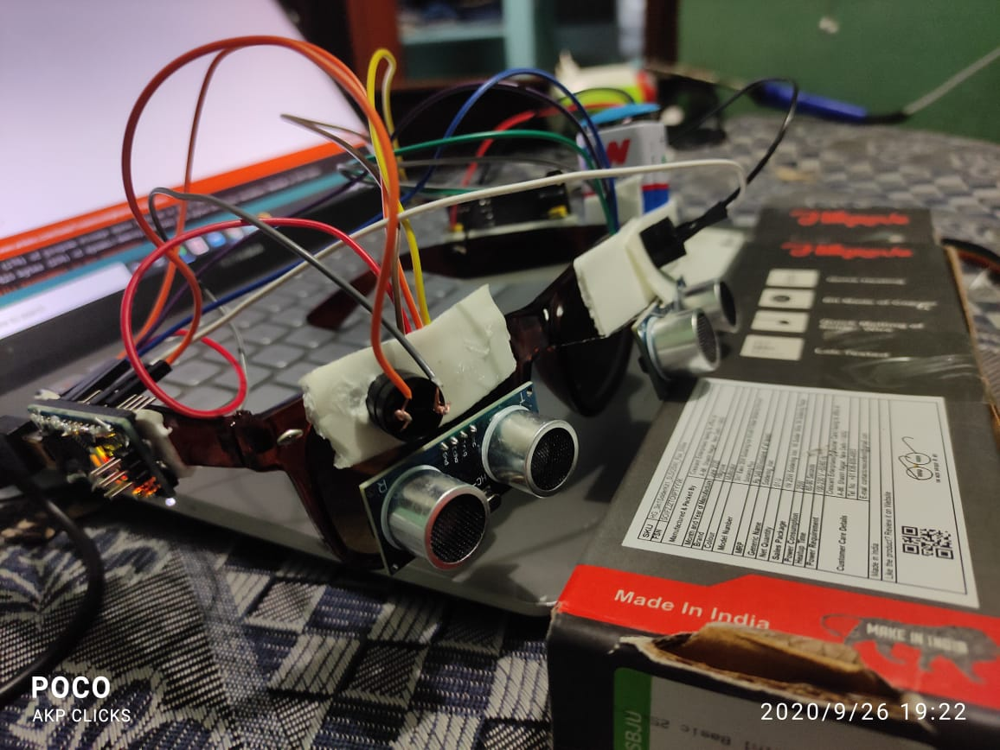

# BLIND-GLASSES
</jpg>

### This is the initial stage of the project
### Now this glasses will alert the user when any object came in the region of the sensor
### this model is build using ultrasonic sensor and Arduino nano.
